Tidy Tuesday at R-Ladies Melbourne Inc: data wrangling and visualisation of the measles vaccination rate in the US
===============
Momeneh (Sepideh) Foroutan (27th of Feb 2020)
---------------------------------
-   [Explore the data](#explore-the-data)
-   [Visualisation](#visualisation)
    -   [Barplot](#barplot)
    -   [Scatterplot](#scatterplot)
    -   [Map](#map)
        -   [coord\_quickmap](#coord_quickmap)
        -   [Make it interactive](#make-it-interactive)
        -   [usmap](#usmap)
-   [Session info](#session-info)

Measles is a very contagious respiratory infection, and [this tidy
tuesday
data](https://github.com/rfordatascience/tidytuesday/blob/master/data/2020/2020-02-25/readme.md)
has vaccination rates for 46,412 schools in 32 states in the US,
inluding overall vaccination rate, Measles, Mumps, and Rubella (MMR)
vaccination rate, as well percent of student who were exempted form the
vaccination due to different reasons.

First we read in the data, and load the `tidyverse` library.

``` r
measles <- readr::read_csv('https://raw.githubusercontent.com/rfordatascience/tidytuesday/master/data/2020/2020-02-25/measles.csv')

library(tidyverse)
```

Explore the data
================

Looking at the dimension, head, structure and summary of the data, gives
us some insight about the datasets. Bases on these, we realise that
there are -1 in the mmr and overall columns, which we may want to take
this into account when visualising the data. You may also have noticed
that one of the exemption columns is logical instead of numeric. This
also help to see which columns have how many NAs.

``` r
dim(measles)
```

    ## [1] 66113    16

``` r
head(measles)
```

    ## # A tibble: 6 x 16
    ##   index state year  name  type  city  county district enroll   mmr overall xrel 
    ##   <dbl> <chr> <chr> <chr> <chr> <chr> <chr>  <lgl>     <dbl> <dbl>   <dbl> <lgl>
    ## 1     1 Ariz… 2018… A J … Publ… Noga… Santa… NA           51   100      -1 NA   
    ## 2     2 Ariz… 2018… Acad… Char… Tucs… Pima   NA           22   100      -1 NA   
    ## 3     3 Ariz… 2018… Acad… Char… Tucs… Pima   NA           85   100      -1 NA   
    ## 4     4 Ariz… 2018… Acad… Char… Phoe… Maric… NA           60   100      -1 NA   
    ## 5     5 Ariz… 2018… Accl… Char… Phoe… Maric… NA           43   100      -1 NA   
    ## 6     6 Ariz… 2018… Alfr… Publ… Phoe… Maric… NA           36   100      -1 NA   
    ## # … with 4 more variables: xmed <dbl>, xper <dbl>, lat <dbl>, lng <dbl>

``` r
str(measles)
```

    ## Classes 'spec_tbl_df', 'tbl_df', 'tbl' and 'data.frame': 66113 obs. of  16 variables:
    ##  $ index   : num  1 2 3 4 5 6 7 8 9 10 ...
    ##  $ state   : chr  "Arizona" "Arizona" "Arizona" "Arizona" ...
    ##  $ year    : chr  "2018-19" "2018-19" "2018-19" "2018-19" ...
    ##  $ name    : chr  "A J Mitchell Elementary" "Academy Del Sol" "Academy Del Sol - Hope" "Academy Of Mathematics And Science South" ...
    ##  $ type    : chr  "Public" "Charter" "Charter" "Charter" ...
    ##  $ city    : chr  "Nogales" "Tucson" "Tucson" "Phoenix" ...
    ##  $ county  : chr  "Santa Cruz" "Pima" "Pima" "Maricopa" ...
    ##  $ district: logi  NA NA NA NA NA NA ...
    ##  $ enroll  : num  51 22 85 60 43 36 24 22 26 78 ...
    ##  $ mmr     : num  100 100 100 100 100 100 100 100 100 100 ...
    ##  $ overall : num  -1 -1 -1 -1 -1 -1 -1 -1 -1 -1 ...
    ##  $ xrel    : logi  NA NA NA NA NA NA ...
    ##  $ xmed    : num  NA NA NA NA 2.33 NA NA NA NA NA ...
    ##  $ xper    : num  NA NA NA NA 2.33 NA 4.17 NA NA NA ...
    ##  $ lat     : num  31.3 32.2 32.1 33.5 33.5 ...
    ##  $ lng     : num  -111 -111 -111 -112 -112 ...
    ##  - attr(*, "spec")=
    ##   .. cols(
    ##   ..   index = col_double(),
    ##   ..   state = col_character(),
    ##   ..   year = col_character(),
    ##   ..   name = col_character(),
    ##   ..   type = col_character(),
    ##   ..   city = col_character(),
    ##   ..   county = col_character(),
    ##   ..   district = col_logical(),
    ##   ..   enroll = col_double(),
    ##   ..   mmr = col_double(),
    ##   ..   overall = col_double(),
    ##   ..   xrel = col_logical(),
    ##   ..   xmed = col_double(),
    ##   ..   xper = col_double(),
    ##   ..   lat = col_double(),
    ##   ..   lng = col_double()
    ##   .. )

``` r
summary(measles)
```

    ##      index         state               year               name          
    ##  Min.   :   1   Length:66113       Length:66113       Length:66113      
    ##  1st Qu.: 429   Class :character   Class :character   Class :character  
    ##  Median : 997   Mode  :character   Mode  :character   Mode  :character  
    ##  Mean   :1608                                                           
    ##  3rd Qu.:2133                                                           
    ##  Max.   :8066                                                           
    ##                                                                         
    ##      type               city              county          district      
    ##  Length:66113       Length:66113       Length:66113       Mode:logical  
    ##  Class :character   Class :character   Class :character   NA's:66113    
    ##  Mode  :character   Mode  :character   Mode  :character                 
    ##                                                                         
    ##                                                                         
    ##                                                                         
    ##                                                                         
    ##      enroll            mmr            overall         xrel        
    ##  Min.   :   0.0   Min.   : -1.00   Min.   : -1.00   Mode:logical  
    ##  1st Qu.:  46.0   1st Qu.: -1.00   1st Qu.: -1.00   TRUE:109      
    ##  Median :  80.0   Median : 95.00   Median : 87.00   NA's:66004    
    ##  Mean   : 131.9   Mean   : 63.17   Mean   : 54.09                 
    ##  3rd Qu.: 129.0   3rd Qu.: 98.00   3rd Qu.: 96.10                 
    ##  Max.   :6222.0   Max.   :100.00   Max.   :100.00                 
    ##  NA's   :16260                                                    
    ##       xmed             xper             lat             lng         
    ##  Min.   :  0.04   Min.   :  0.17   Min.   :24.55   Min.   :-124.50  
    ##  1st Qu.:  1.00   1st Qu.:  2.84   1st Qu.:35.69   1st Qu.:-117.63  
    ##  Median :  2.00   Median :  5.00   Median :40.21   Median : -89.97  
    ##  Mean   :  2.91   Mean   :  6.78   Mean   :39.15   Mean   : -96.28  
    ##  3rd Qu.:  3.53   3rd Qu.:  7.55   3rd Qu.:42.18   3rd Qu.: -81.75  
    ##  Max.   :100.00   Max.   :169.23   Max.   :49.00   Max.   :  80.21  
    ##  NA's   :45122    NA's   :57560    NA's   :1549    NA's   :1549

We can also look at the tables of different columns. Looking at this, we
see that the year column has some grouping issues, that you may want to
change.

``` r
selCols <- c("state", "year", "type")
apply(measles[, selCols], 2, table )
```

    ## $state
    ## 
    ##        Arizona       Arkansas     California       Colorado    Connecticut 
    ##           1451            567          16098           1509            795 
    ##        Florida          Idaho       Illinois           Iowa          Maine 
    ##           2678            475           7686           1370            357 
    ##  Massachusetts       Michigan      Minnesota       Missouri        Montana 
    ##           1594           2351           1813            748            645 
    ##     New Jersey       New York North Carolina   North Dakota           Ohio 
    ##           2211           4275           2085            387           3165 
    ##       Oklahoma         Oregon   Pennsylvania   Rhode Island   South Dakota 
    ##           1249            817           1939            230            390 
    ##      Tennessee          Texas           Utah        Vermont       Virginia 
    ##           1152            811            604            349           1468 
    ##     Washington      Wisconsin 
    ##           2221           2623 
    ## 
    ## $year
    ## 
    ##    2017 2017-18 2018-19    null 
    ##    1939   10418   48075    5681 
    ## 
    ## $type
    ## 
    ##        BOCES      Charter Kindergarten    Nonpublic      Private       Public 
    ##           47          276         1488          173         6815        20692

Now, to do some visualisations, lets calculate the average of the
vaccination rates and different expemtion columns.

``` r
mstat <- measles %>%
  group_by(state) %>%
  mutate(ave_xmed = mean(xmed, na.rm = T),
         ave_xper = mean(xper, na.rm = T),
         ave_xrel = mean(xrel, na.rm = T),
         ave_enroll = mean(enroll, na.rm = T),
         ave_mmr = mean(mmr, na.rm = T),
         ave_overall = mean(overall, na.rm = T)) %>%
  data.frame() 
```

Visualisation
=============

Barplot
-------

In order to make barplots for the vaccination rate columns, we make sure
that we filter out -1 values from that column. As we have calculated the
mean vaccination rate values per state, we remove duplicated rows too.
Note that we can order the barplots, simply by using the `reorder()`
function.

``` r
mstat %>%  
  filter(! duplicated(state) & ave_overall != -1) %>% 
ggplot(., aes(x = reorder(state, ave_overall), y = ave_overall)) + 
  geom_bar(stat = "identity", fill = "gray20") +
  ggtitle("Average overall vaccination across states") +
  theme_bw() +
  theme(axis.text.x = element_text(angle = 45, hjust = 1))
```

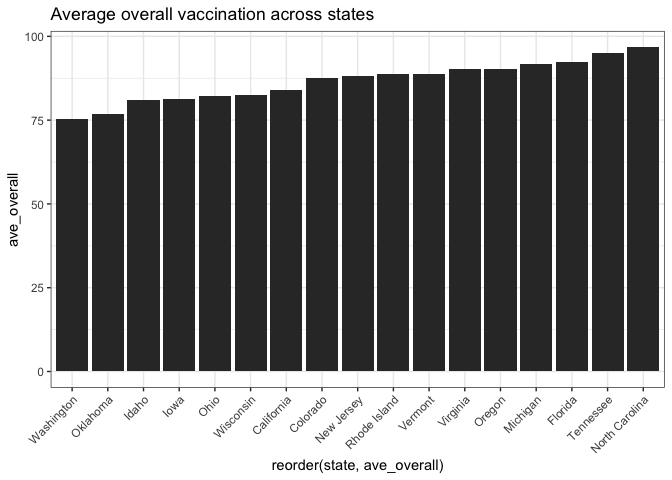

``` r
mstat %>%  
  filter(! duplicated(state) & ave_mmr != -1) %>% 
ggplot(., aes(x = reorder(state, ave_mmr), y = ave_mmr)) + 
  geom_bar(stat = "identity", fill = "gray60") +
  ggtitle("Average MMR vaccination across states") +
  theme_bw() +
  theme(axis.text.x = element_text(angle = 45, hjust = 1))
```

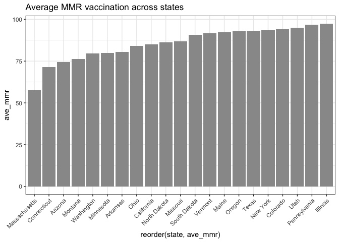

Now, if we want to know what percent exemption of different reasons we
have in each state, we should first change the structure of the data to
be in the long format, so that all teh info for different exemptions go
into one column. For this, we use `pivot_longer()` function. The output
of this can be directly used in the `ggplot()` function. Note that we
also filter for NaN valuse in the new column “Average\_values”.

``` r
mstat %>%
  filter(!duplicated(state)) %>%
  pivot_longer(.,
               cols = ave_xmed:ave_xrel,
               names_to = "Exemption",
               values_to = "Average_values") %>%
  filter(!is.nan(Average_values)) %>%
  ggplot(., aes(
    x = reorder(state, ave_mmr),
    y = Average_values,
    fill = Exemption
  )) +
  geom_bar(stat = "identity",
           position = "dodge",
           width = 0.8) +
  theme_bw() +
  theme(axis.text.x = element_text(angle = 45, hjust = 1))
```

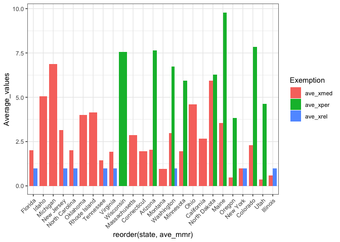

Scatterplot
-----------

The other way of looking at the data is to examine associations. For
example, there seems to be a positive correlation between overall
vaccination rate and mmr, however, there are schools in some states,
such as Colorado that have high mmr but generally lower overall
vaccination rate.

``` r
mstat %>%
  filter(overall != -1 & mmr != -1) %>%
  ggplot(., aes(x = mmr, y = overall, color = state)) +
  geom_point(alpha = 0.6) +
  theme_bw()
```

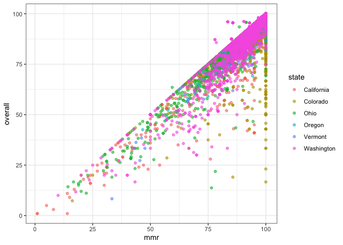

Map
---

We can also examine this data in form of a map. There are several ways
of doing this but here I am giving two simple examples to get started.
These include using the `coord_quickmap()` function from ggplot2 and
`plot_usmap()` function from usmap package.

### coord\_quickmap

Here, we plot all lng and lat, and then because there seem to be some
outliers in these data, we focus on only those lng and lat that properly
covers the US coordinates. Then we show how to simply color that based
on state.

``` r
ggplot(mstat, aes(lng, lat)) + 
  geom_point(size = .25, show.legend = FALSE) +
  coord_quickmap()
```

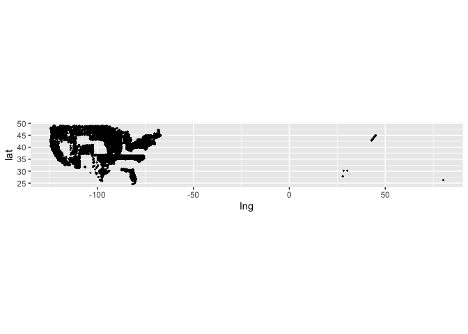

``` r
mstat %>% 
  filter(lng < -60 ) %>% 
ggplot(., aes(lng, lat)) + 
  geom_point(size = .25, show.legend = FALSE) +
  coord_quickmap()
```

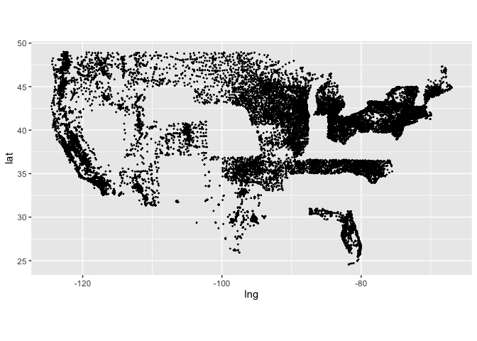

``` r
mstat %>% 
  filter(lng < -60 ) %>% 
ggplot(., aes(lng, lat, color = state)) + 
  geom_point(size = .25, show.legend = FALSE) +
  coord_quickmap()
```

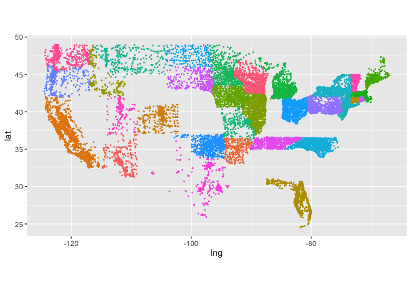

We can also colour the points based on some continuous values, such as
mmr or overall. To have a better contrast in the colour, I decided to
keep -1 values, however, you can remove it and see what your plot looks
like.

``` r
mstat %>%
  filter(lng < -60) %>%
  # filter(mmr != -1) %>%
  ggplot(., aes(lng, lat, color = mmr)) +
  geom_point(size = .25, show.legend = TRUE) +
  scale_color_viridis_c(name = "MMR", label = scales::comma) +
  coord_quickmap() +
  theme(legend.position = "right") +
  theme_dark()
```

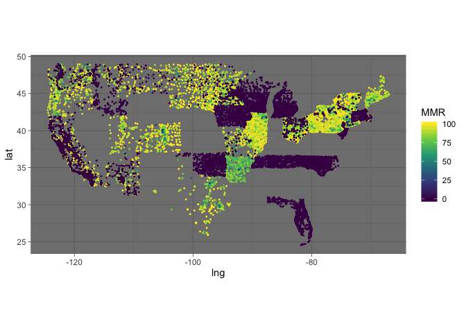

``` r
mstat %>%
  filter(lng < -60) %>%
  # filter(overall != -1) %>%
  ggplot(., aes(lng, lat, color = overall)) +
  geom_point(size = .25, show.legend = TRUE) +
  scale_color_viridis_c(name = "Overall", label = scales::comma) +
  coord_quickmap() +
  theme(legend.position = "right") +
  theme_dark()
```

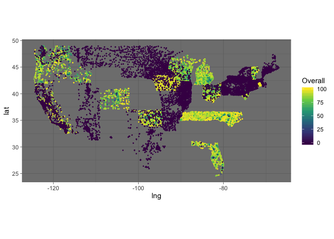

### Make it interactive

Now, we subset the data to those that do not have -1 in overall column
and color based on the mmr values. We can zoom on different states and
make the plots inteactive using the plotly package and `ggplotly()`
function. Uncomment `plotly::ggplotly(p, tiptools = "text")` in the
below code in your computer to see the interactivity.

``` r
p <- mstat %>%
  filter(lng < -110) %>%
  filter(overall != -1) %>%
  ggplot(., aes(lng, lat, color = mmr, text = name)) +
  geom_point(size = .25, show.legend = TRUE) +
  scale_color_viridis_c(name = "MMR", label = scales::comma) +
  coord_quickmap() +
  theme(legend.position = "right") +
  theme_dark()

p
```

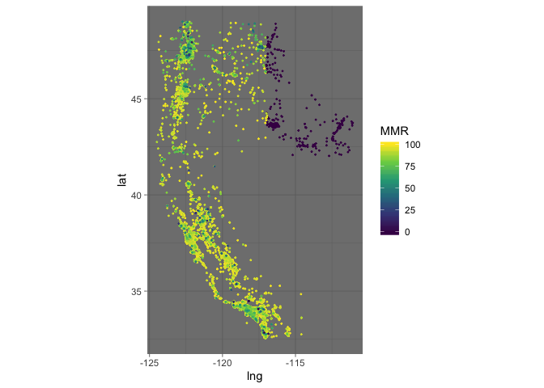

``` r
# plotly::ggplotly(p, tiptools = "text")
```

### usmap

As I mentioned above, we can also use usmap package to generate maps for
the US. To do this, I have been looking at the post
[here](https://cran.r-project.org/web/packages/usmap/vignettes/mapping.html);
but there are obviously other relevant posts, such as
[this](https://remiller1450.github.io/s230s19/Intro_maps.html) that
shows how to generate maps using ggplot2, for example using
`geom_polygon()` function.

Note that as we do not have state abbreviations, we use state.name and
state.abb from the usmap, merge these to our data and use `plot_usmap()`
to visualise it.

``` r
library(usmap)

mstatUniqueState <- mstat[! duplicated(mstat$state), ]
abbr_state <- tibble(state = state.name, abb = state.abb)
  
mstatUniqueState %>% 
  filter(ave_mmr != -1) %>% 
  left_join(abbr_state) %>% 
plot_usmap(
  data = .,
  region = "state",
  values = "ave_mmr",
  color = "purple"
) +
  scale_fill_viridis_c(name = "MMR", label = scales::comma) +
  theme(legend.position = "right") +
  theme(panel.background = element_rect(color = "white", fill = "gray10"))
```

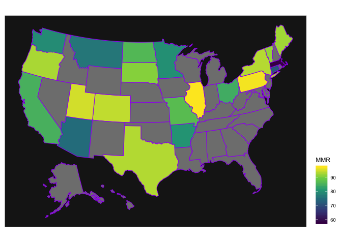

``` r
mstatUniqueState %>% 
  filter(ave_overall != -1) %>% 
  left_join(abbr_state) %>% 
plot_usmap(
  data = .,
  region = "state",
  values = "ave_overall",
  color = "purple"
) +
  scale_fill_viridis_c(name = "Overall", label = scales::comma) +
  theme(legend.position = "right") +
  theme(panel.background = element_rect(color = "white", fill = "gray10"))
```

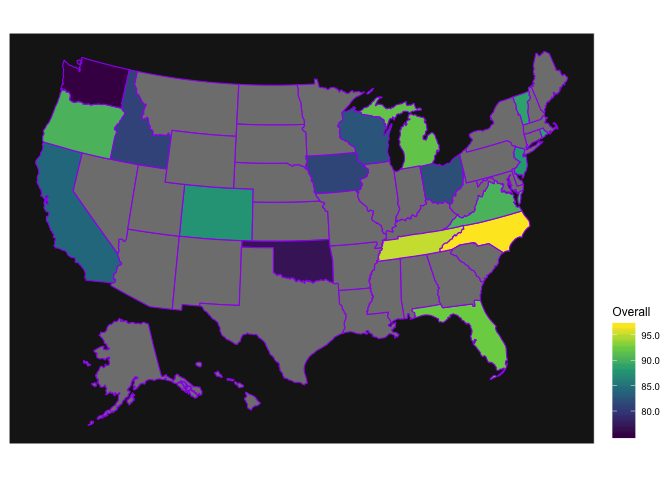

Session info
============

``` r
sessionInfo()
```

    ## R version 3.6.1 (2019-07-05)
    ## Platform: x86_64-apple-darwin15.6.0 (64-bit)
    ## Running under: macOS Catalina 10.15.1
    ## 
    ## Matrix products: default
    ## BLAS:   /Library/Frameworks/R.framework/Versions/3.6/Resources/lib/libRblas.0.dylib
    ## LAPACK: /Library/Frameworks/R.framework/Versions/3.6/Resources/lib/libRlapack.dylib
    ## 
    ## locale:
    ## [1] en_AU.UTF-8/en_AU.UTF-8/en_AU.UTF-8/C/en_AU.UTF-8/en_AU.UTF-8
    ## 
    ## attached base packages:
    ## [1] stats     graphics  grDevices utils     datasets  methods   base     
    ## 
    ## other attached packages:
    ##  [1] usmap_0.5.0     forcats_0.4.0   stringr_1.4.0   dplyr_0.8.4    
    ##  [5] purrr_0.3.3     readr_1.3.1     tidyr_1.0.2     tibble_2.1.3   
    ##  [9] ggplot2_3.2.1   tidyverse_1.3.0
    ## 
    ## loaded via a namespace (and not attached):
    ##  [1] tidyselect_1.0.0  xfun_0.12         haven_2.2.0       lattice_0.20-38  
    ##  [5] colorspace_1.4-1  vctrs_0.2.2       generics_0.0.2    viridisLite_0.3.0
    ##  [9] htmltools_0.4.0   yaml_2.2.1        utf8_1.1.4        rlang_0.4.4      
    ## [13] pillar_1.4.3      withr_2.1.2       glue_1.3.1        DBI_1.1.0        
    ## [17] dbplyr_1.4.2      modelr_0.1.5      readxl_1.3.1      lifecycle_0.1.0  
    ## [21] munsell_0.5.0     gtable_0.3.0      cellranger_1.1.0  rvest_0.3.5      
    ## [25] evaluate_0.14     labeling_0.3      knitr_1.28        curl_4.3         
    ## [29] fansi_0.4.1       broom_0.5.4       Rcpp_1.0.3        backports_1.1.5  
    ## [33] scales_1.1.0      jsonlite_1.6.1    farver_2.0.3      fs_1.3.1         
    ## [37] hms_0.5.3         digest_0.6.23     stringi_1.4.5     grid_3.6.1       
    ## [41] cli_2.0.1         tools_3.6.1       magrittr_1.5      lazyeval_0.2.2   
    ## [45] crayon_1.3.4      pkgconfig_2.0.3   xml2_1.2.2        reprex_0.3.0     
    ## [49] lubridate_1.7.4   assertthat_0.2.1  rmarkdown_2.1     httr_1.4.1       
    ## [53] rstudioapi_0.11   R6_2.4.1          nlme_3.1-144      compiler_3.6.1
